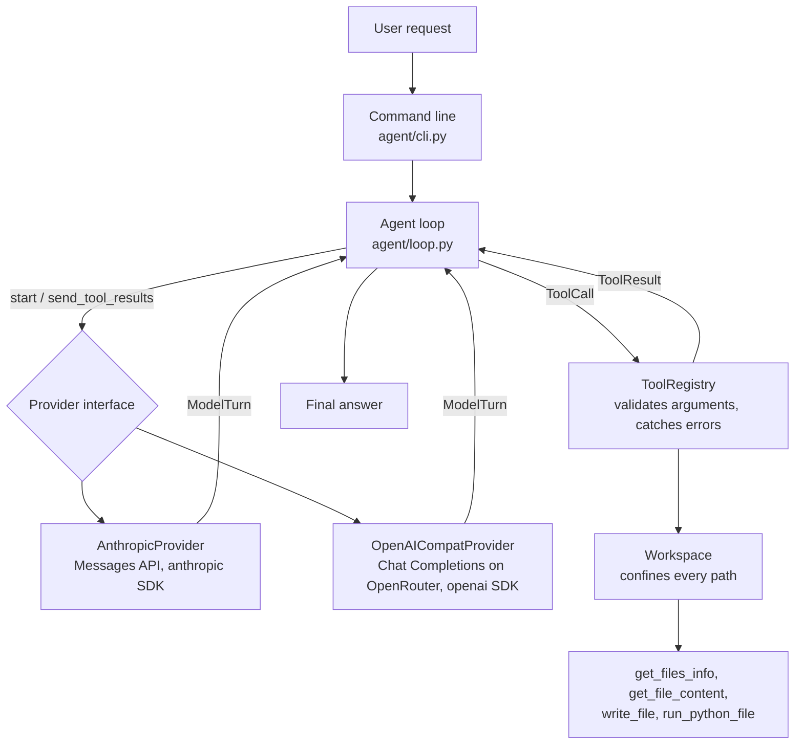

# AI Coding Agent

A command-line agent that works on the files of one directory. It sends your
request to a language model together with four tools, runs the tools the model
calls, returns the results, and repeats until the model gives a final answer
or a limit stops the run.

It runs on **Claude**, through the official Anthropic SDK, or on any model
served by **OpenRouter**, through the OpenAI SDK. The agent loop and the tools
are the same for both.

This repository started as a guided course project and was then extended. The
section [Project origin and what was added](#project-origin-and-what-was-added)
says exactly which parts are which.

## Overview

```bash
uv run main.py "the tests in tests.py fail, find out why and fix it" --provider anthropic
```

The model can list directories, read files, write files and run Python files
inside the working directory (by default the sample project in `calculator/`).
A typical run lists the project, reads the relevant source, writes a corrected
file, runs the program or its tests to check the change, and then reports what
it did.

It is a small, readable implementation of the tool-calling loop that coding
agents are built on. It is not a sandbox and not a product: see
[Safety and limitations](#safety-and-limitations).

## Architecture



**The loop** (`agent/loop.py`) knows nothing about any particular model. It
asks the provider for a `ModelTurn`. If the turn contains tool calls, it runs
them through the registry and sends the results back; if it contains none, the
turn's text is the final answer. It stops after `--max-iterations` model calls
(20 by default). When that cap is reached while the model is still asking for
tools, those last calls are not executed, because their results could never be
sent back. A response that was cut off by a token limit is never acted on,
since it may contain half a tool call.

**The provider layer** (`agent/providers/`) is one small interface with two
methods, `start(user_prompt)` and `send_tool_results(results)`. Each provider
keeps the conversation in its own wire format and translates to and from the
neutral types in `agent/types.py`:

| | Anthropic | OpenRouter |
|---|---|---|
| Tool definition | `name`, `description`, `input_schema` | `type: function` wrapper with `parameters` |
| Tool call in the response | `tool_use` content block, `input` already parsed | `tool_calls` entry, arguments as a JSON string |
| Tool result in the next request | `tool_result` blocks in one user message, with `is_error` | one `role: tool` message per call |
| Assistant turn in the history | returned unchanged, including any thinking blocks | the SDK message object, returned unchanged |
| Cut-off response | `stop_reason` of `max_tokens` or `model_context_window_exceeded` | `finish_reason` of `length` |

**Tool execution** (`agent/tools.py`). The registry looks up the tool, checks
the arguments against the tool's JSON schema (required, unexpected and
wrongly-typed arguments), runs it, and turns every failure into an error
result that the model can read. A tool call never raises into the loop.

**Workspace confinement** (`agent/workspace.py`). Every path a tool receives is
resolved against the working directory with symbolic links followed, and is
rejected unless the result is inside it. The model never supplies the working
directory itself.

## Features

- Multi-step tool-calling loop with a configurable cap on model calls.
- Two providers behind one interface: Claude through the Anthropic Messages
  API, and OpenAI-compatible models through OpenRouter.
- Several tool calls in one model turn are executed in order and answered
  together.
- Four tools confined to one working directory.
- Argument validation and error results instead of crashes: malformed JSON,
  missing or unexpected arguments, unknown tools, paths outside the workspace.
- Python execution with a 30-second timeout, capped output, no API keys in the
  child process's environment, and a switch to turn it off (`--no-exec`).
- Markdown transcript of a run (`--transcript`), and a verbose mode showing
  arguments, results and token usage.
- 119 automated tests that need no network access and no API key.

## Tools

| Tool | Arguments | What it does | Restrictions |
|---|---|---|---|
| `get_files_info` | `directory` (optional) | Lists a directory: name, size in bytes, whether each entry is a directory. | Inside the working directory only. Does not recurse. |
| `get_file_content` | `file_path` | Returns a UTF-8 text file. | Inside the working directory only. Cut off after 10,000 characters, and says so. Binary files are refused. |
| `write_file` | `file_path`, `content` | Creates or replaces a file, creating parent directories. | Inside the working directory only. Replaces the whole file; there is no backup. |
| `run_python_file` | `file_path`, `args` (optional list of strings) | Runs a `.py` file with the current Python interpreter and returns exit code, stdout and stderr. | The file must be inside the working directory. Stopped after 30 seconds. Output cut off after 10,000 characters. Not sandboxed: see below. |

## Supported providers and models

| Provider | Flag | API and SDK | Key | Default model |
|---|---|---|---|---|
| Anthropic | `--provider anthropic` | Messages API, `anthropic` SDK | `ANTHROPIC_API_KEY` | `claude-sonnet-5-5` |
| OpenRouter | `--provider openrouter` (default) | Chat Completions at `openrouter.ai`, `openai` SDK | `OPENROUTER_API_KEY` | `google/gemini-2.5-flash` |

`--model` accepts any model id the provider serves that supports tool calling,
for example `claude-opus-5-5` or `claude-haiku-4-5-20251001` with Anthropic.
No other providers are implemented.

## Setup

Requires Python 3.10 or newer and [uv](https://docs.astral.sh/uv/).

```bash
git clone https://github.com/Baraa-Rj/ai-agent
cd ai-agent
uv sync
cp .env.example .env      # then put your key in .env
```

`.env` is ignored by git. Keys are read from the environment only; none is
stored in the repository.

## Usage

```bash
# Claude
uv run main.py "explain what pkg/calculator.py does" --provider anthropic

# OpenRouter (the default provider)
uv run main.py "explain what pkg/calculator.py does"

# another model, another directory, more detail
uv run main.py "add a test for division by zero and run the tests" \
    --provider anthropic --model claude-opus-5-5 --workdir ./calculator --verbose

# let the model read and write, but not run code
uv run main.py "tidy the formatting of main.py" --no-exec
```

| Option | Default | Meaning |
|---|---|---|
| `--provider` | `$AGENT_PROVIDER`, else `openrouter` | `anthropic` or `openrouter` |
| `--model` | `$AGENT_MODEL`, else the provider's default | model id |
| `--workdir` | `./calculator` | directory the agent may read, write and run files in |
| `--max-iterations` | 20 | maximum number of model calls |
| `--max-tokens` | 4096 | maximum output tokens per model call |
| `--no-exec` | off | do not offer the `run_python_file` tool |
| `--transcript FILE` | none | write a Markdown transcript of the run |
| `--verbose` | off | show tool arguments, tool results and token usage |

Exit code 0 means the model gave a final answer, 1 means the run stopped early
(iteration cap, cut-off response or API error), 2 means a configuration
problem such as a missing key.

## Recording a run

`--transcript` records everything that happened in a run: each model call,
each tool call with its arguments, each result and the final answer. This
command records a multi-step task on the sample project:

```bash
uv run main.py "Add a power operator ^ to the calculator that binds tighter than * and /. Add unit tests for it to tests.py and run the tests." \
    --provider anthropic --transcript docs/example-run.md
```

The task changes files in `calculator/`. Run `git checkout calculator` to
restore the sample project afterwards.

## Tests

```bash
uv run pytest
```

119 tests, none of which uses the network:

- **Workspace**: relative and absolute paths, `..` traversal, symbolic links to
  files and directories outside, null bytes.
- **Tools**: each tool's normal behaviour, truncation, empty files and
  directories, binary files, timeouts, exit codes, environment scrubbing, and a
  regression test for stale bytecode after an edit.
- **Registry**: dispatch, unknown tools, missing, unexpected and wrongly-typed
  arguments, exceptions inside a tool.
- **Loop**: single and multiple tool calls per turn, the iteration cap, cut-off
  responses, malformed arguments, failing tools.
- **Providers**: both are driven through their real SDK with a mock HTTP
  transport, so the tests check the exact request bodies the SDK sends and how
  real response bodies are parsed. For Claude that includes tool definitions,
  `tool_use` parsing, `tool_result` blocks with `is_error`, parallel tool
  calls, the assistant turn (with thinking blocks) returned unchanged, stop
  reasons and API errors.
- **End to end**: the command line, loop, Claude provider, SDK and tools fix a
  planted bug in a copy of the calculator against a scripted stand-in for the
  API, which rejects requests that break the tool-result protocol.
- **Command line**: provider and model selection, missing keys, exit codes,
  `--no-exec`, `--verbose`, transcripts.

These tests show that the agent speaks each API's format correctly and handles
failures. They use prepared model responses, so they say nothing about how
well a given model solves a task. Continuous integration runs the linter and
the tests on Python 3.10 and 3.13.

## Safety and limitations

**This is not a sandbox.** The working-directory check applies to the paths
given to the tools. It does not restrict what an executed program does.

- `run_python_file` runs code the model chose, as an ordinary process with
  your user's permissions. That code can read and write files anywhere your
  account can, use the network and start other processes. The 30-second
  timeout stops the script, not necessarily processes it started.
- What reduces the risk, without removing it: only `.py` files inside the
  working directory can be started, variables whose names end in `_API_KEY`,
  `_TOKEN`, `_SECRET` or `_PASSWORD` are removed from the script's
  environment, and `--no-exec` removes the tool entirely.
- Run the agent only on directories you are willing to have changed. For
  anything you do not fully trust, including the model's own output, run it in
  a container or a virtual machine.
- `write_file` replaces whole files without confirmation or backup. Use
  version control.
- The path check resolves symbolic links at the time of the check. A link
  changed between the check and the file operation is not caught.
- File contents and program output go to the model as tool results. Text in
  them can try to steer the model (prompt injection), and nothing here
  detects that.

Other limits:

- One request per run. The conversation is kept in memory and not saved
  between runs.
- No streaming, no retries beyond what the SDKs do themselves, no cost limit
  other than the cap on model calls and output tokens.
- Files are read up to 10,000 characters, so the model sees long files only
  in part and `write_file` cannot safely rewrite them.
- Only Anthropic and OpenRouter are implemented.

## Project origin and what was added

This project began as the guided project of Boot.dev's
[Build an AI Agent in Python](https://www.boot.dev/courses/build-ai-agent-python)
course. Commit `a9ab8a3` is the project as completed in that course: a
single-file loop calling an OpenRouter model through the OpenAI SDK, the four
tools, a fixed `./calculator` working directory, the system prompt, and the
`calculator/` sample project. The tool names, the wording of the system prompt
and the sample project are still the course's.

Everything after that commit is an extension:

- **Claude support** with the official `anthropic` SDK, using the Messages
  API's own tool-use format rather than a compatibility layer.
- **A provider interface**, so the loop is independent of the model API, with
  the original OpenRouter code moved behind it.
- **A tool registry with argument validation.** In the course version a
  malformed tool call (invalid JSON, a missing or misspelled argument) raised
  an exception and ended the run.
- **Stricter workspace confinement.** Paths are now resolved with symbolic
  links followed; the course version compared normalised paths, so a link
  inside the directory could lead out of it.
- **A safer Python tool**: the running interpreter instead of whatever
  `python` is on the path, API keys removed from the child environment,
  capped output, and `--no-exec`.
- **Three bug fixes**: reading an empty file or listing an empty directory
  ended the run with "No content returned"; a script could run from stale
  bytecode right after an edit; and tools requested on the last allowed
  iteration were executed although their results were never sent back.
- **Handling of cut-off responses**, which are no longer acted on.
- **Command-line options** for provider, model, working directory, limits,
  transcripts and verbose output.
- **The test suite, the linter configuration and continuous integration.**

These extensions were implemented with Claude, Anthropic's model, working as
a coding agent from a written specification. The commits that add them are
marked `Co-Authored-By: Claude`.

## Repository layout

```
main.py                  entry point
agent/
    cli.py               command-line options, wiring, exit codes
    loop.py              the agent loop
    types.py             provider-neutral data types
    tools.py             the four tools, argument validation, registry
    workspace.py         path confinement
    prompts.py           system prompt
    transcript.py        console output and Markdown transcripts
    providers/
        base.py                  provider interface and errors
        anthropic_messages.py    Claude, Anthropic Messages API
        openai_compat.py         OpenRouter, Chat Completions
calculator/              sample project the agent works on (from the course)
tests/                   pytest suite
.env.example             the environment variables the agent reads
```
